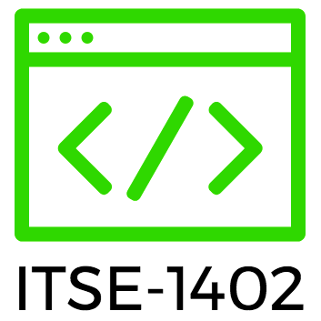

#  **Intermediate Python**

 

* **Course:** [ITSE-1402](http://continue.austincc.edu/schedule/courses?name=Intermediate%20Python) @ [Austin Community College](http://continue.austincc.edu/)
* **Instructor:** Philip Ulrich [[philip.ulrich@austincc.edu](mailto:philip.ulrich@austincc.edu)]
* **Location:** Highland Business Center - Room: 301.10
* **Date/Time:** Sep 19 - Nov 2 - Tues/Thur - 6:00pm - 9:00pm

 

## <i class="fa fa-pencil"></i> Course Description
Utilizing Python 3, Intermediate Python is a project-based class in which you will learn the ins and outs of the Python language beginning where the introduction class left off. This class takes a new approach to learning python and integrates with many of the same technologies you would see working in the development world such as GitHub and cloud IDEs. This course will give you the tools and experience you need to apply the Python programming language in real world scenarios upon completion.
**Required Book:** Think Python 2nd Edition by Allen B. Downey. 
*A copy will be provided for you free of charge and is also available for free via [eBook](http://greenteapress.com/thinkpython2/thinkpython2.pdf).*

Computers are provided in the lab, however you are encouraged to use whatever device you feel most comfortable with and are more than welcome to bring a laptop/tablet/hybrid/etc if you wish.

 

## <i class="fa fa-vcard"></i> Prerequisites

* [ITSE-2079 - Introduction to Python](http://continue.austincc.edu/schedule/courses?name=Introduction%20to%20Python) or novice knowledge of Python and OOO languages. 
* Understanding of variables, data types, and basic function usage in Python 3
* Basic understanding of HTML and CSS

These prerequisites are more of a guideline as opposed to hard requirement. You can still take the class without them, but it could prove to be more difficult. The first couple classes will be a high level overview of Chapters 1-8 of [Think Python 2nd Edition](http://greenteapress.com/thinkpython2/thinkpython2.pdf). We will be completing the exercises in class as a refresher.  

 

## <i class="fa fa-font"></i> Course Grading
Despite the fact that this class is not for credit, we will be keeping track of grades throughout the course and a final grade will be submitted at the end. Information about how grading will work is below:

 

### **Grade Assignment**

| Letter | Percentage |
| :----: | :--------: |
| A+     | Above 100% |
| A      | 90% - 100% |
| B      | 80% - 89%  |
| C      | 70% - 79%  |
| D      | 60% - 69%  |
| F      | Below 60%  |

 

### **Makeup Quiz/Exam Policy**
- There is no limit to the number of quiz/exam makeups that you can take.
- Quizzes and exams may only be taken once and you make only makeup a Quiz/Exam if you are absent.
- Makeup quizzes/exams must be arrange before or immediate after your absence from class.
- Makeup quizzes/exams may be different and more difficult than the missed quiz/exam.

 

### **Assignment Grading**
Assignments will typically be completed in class and will simply be graded on a completion status. If you turn in a complete and running program, you will receive an A. If no assignment is turned in, then you can expect a 0 regardless of whether you were in the class it was assigned in or not. Assignments will be worth a total of 10 points each.

 

### **Project Grading**
Each project will have a grading rubric distributed along with the assignment description. This rubric will outline the possible point values for each project category and how to get the highest grade possible. Assuming that your program runs and meets all of the requirements, you should expect at least an A. Projects will be worth 100 points each.

 

### **Extra Credit**
You may have noticed that an A is the highest grade that is achievable by meeting what is expected of you. Yet there is A+ listed in the grade assignment. This is because extra credit will be available on most projects, quizzes, exams, and periodically throughout the class (in the form of optional challenge assignments). If you happen to miss an assignment or do poorly on a quiz, this will help ensure you keep your grade high. If you do well on everything and don't miss assignments, this will give you extra padding on your grade and possibly even add the coveted '+' to your A. Extra credit assignments will be worth 1-10 points each based on difficulty.  

If no extra credit is available by way of class material, a CodeFights Challenge of the Day may be completed. The extra credit amount will be based on the points it's worth. Where n is equal to the number of points on code fights: extra_credit = (n/1000)*2. 

 

### **Missing Class**
If you miss a class, you will likely either miss the opportunity to turn in an assignment, miss the assignment of work, or possibly both. If you know you are going to miss a class or miss one unexpectedly, work can be turned and assignments requested via email. Work must be turned in by the beginning of class on the day due or you will get no credit. No exceptions. 

 

## <i class="fa fa-calendar"></i> Tentative Schedule

Note: This is being restructured for current Semester Fall 2017

|     Date     | Description                                                     | Assigned                           | Due                            | Extra Credit         |
| :----------: | :-------------------------------------------------------------- | :--------------------------------: | :----------------------------: | :------------------: |
| Tues / 09/19 | Course Introduction / IDE / Git Overview                        | N/A                                | N/A                            | CodeFights Challenge |  
| Thur / 09/21 | Python Review: Chapter 1-8                                      | N/A                                | CF EC                          | CodeFights Challenge |
| Tues / 09/26 | Chapter 9: Case Study: word play                                | Proj 1                             | CF EC                          | CodeFights Challenge |
| Thur / 09/28 | Chapter 10: Lists                                               | 10.11, 10.12                       | CF EC                          | 10.8 - 5pts          | 
| Tues / 10/03 | Chapter 11: Dictionaries / Project 1 Work Time                  | 11.5, 11.6                         | 10.11, 10.12 EC: 10.8          | CodeFights Challenge |
| Thur / 10/05 | Chapter 12: Tuples                                              | 12.3, 12.4                         | 11.5, 11.6                     | CodeFights Challenge |
| Tues / 10/10 | Chapter 13: Case Study: data structure  / Python 2to3           | 13.8, Proj 2                       | 12.3, 12.4, Proj 1             | 2to3 a python2 module| 
| Thur / 10/12 | Chapter 14: Files                                               | 14.3                               | 13.8                           | CodeFights Challenge |
| Tues / 10/17 | Chapter 15/16/17: Classes and Objects/Functions/Methods         | 16.2 / 17.2                        | 14.3                           | CodeFights Challenge | 
| Thur / 10/19 | Chapter 18: Inheritance / Unit Testing                          | 18.3                               | 16.2 / 17.2                    | CodeFights Challenge |
| Tues / 10/24 | Chapter 19: The Goodies / Appendices                            | 19.1                               | 18.3                           | CodeFights Challenge |
| Thur / 10/26 | Django, Falcon, and Flask! Oh my! - An Overview of Full Stack   | TBD                                | 19.1                           | CodeFights Challenge |
| Tues / 10/31 | Building an API in Flask and Falcon                             | TBD                                | TBD                            | TBD                  |
| Thur / 11/02 | Cloud Services and Your Code /  Getting a Job As a Programmer   | N/A                                | Proj 2, TBD                    | N/A                  |

     
